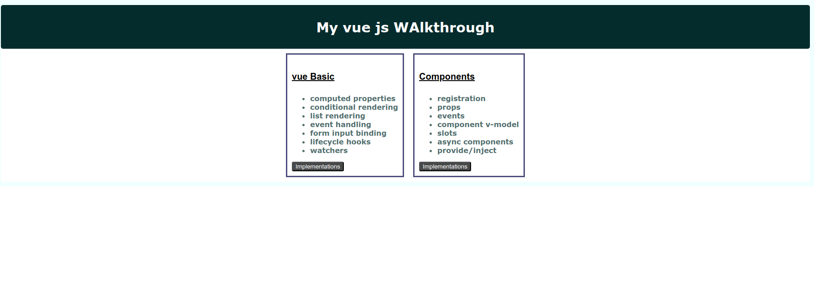
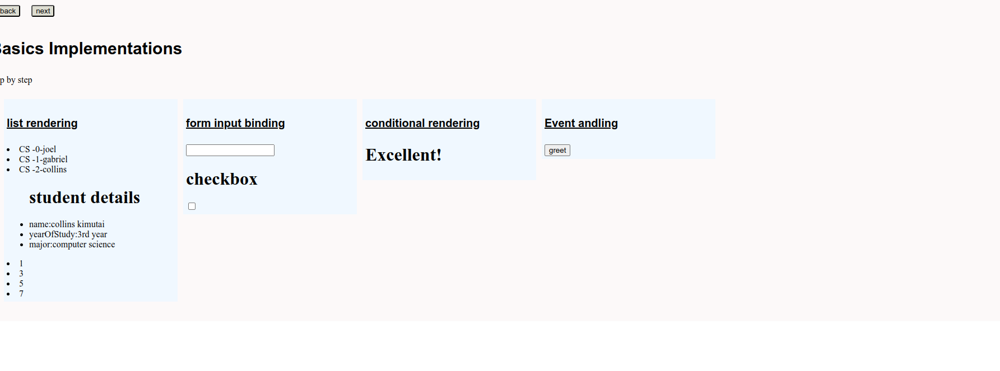
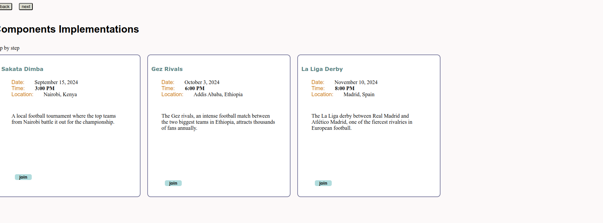

# Vue  concepts implementation
1.Creating an Application 
2.Template Syntax 
3.Reactivity Fundamentals 
4.Computed Properties 
5.Class and Style Bindings 
6.Conditional Rendering 
7.List Rendering 
8.Event Handling 
9.Form Input Bindings 
10.components 
11.vue routing 
# Link
Visit: [Vue learning App](https://vue-walkthrough-web.onrender.com/)
# UI
**Home page**

**Basics page**

**components page**

